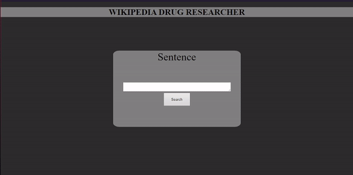

<h1 align="center">Wikipedia Drug Researcher</h1>

Essa aplicação fornece uma interface para pesquisa de drogas na Wikipedia, se utilizando de NLP e NER.

 <a href="#objetivo">Objetivo</a> •
 <a href="#demonstração">Demonstração</a> • 
 <a href="#tecnologias">Tecnologias</a> • 
 <a href="#requisitos">Requisitos</a> • 
 <a href="#status-do-projeto">Status do Projeto</a> • 
 <a href="https://github.com/Samuelvidal99/ner-drugs-api/blob/main/LICENSE">Licença</a> • 
 <a href="#autor">Autor</a>

<h1>Objetivo</h1>
<p1>Essa aplicação teve como objetivo principal o aprendizado de tecnologias como o React, Docker, Django, Django REST Framework, Jupyter Notebook, spaCy, PostgreSQL, conceitos de NLP (Natural Language Processing) e NER (Named-entity recognition), conceitos esses utilizados nas pesquisas do Google, e entender como funciona o processo de treinamento customizado de um modelo spaCy, processo esse explicado nesse <a href='https://github.com/Samuelvidal99/ner-drugs-api/blob/main/jupyter-notebooks/notebooks/ner-drugs-model.ipynb'>jupyter notebook</a>.</p1>

<h1>Demonstração</h1>

<h1 align='center'></img></h1>

## Tecnologias

As seguintes ferramentas foram usadas na construção do projeto:

- [Node.js](https://nodejs.org/en/)
- [React](https://pt-br.reactjs.org/)
- [Docker](https://www.docker.com/)
- [SweetAlert2](https://sweetalert2.github.io)
- [Python](https://www.python.org)
- [Django](https://www.djangoproject.com)
- [Django REST Framework](https://www.django-rest-framework.org)
- [spaCy](https://spacy.io)
- [MediaWiki API](https://en.wikipedia.org/w/api.php)
- [Jupyter Notebook](https://jupyter.org)
- [PostgreSQL](https://www.postgresql.org)

<h1>Requisitos</h1>
<p1>Para utilizar essa aplicação basta possuir uma versão do docker-compose 1.17.1, ou superior, baixar a aplicação e iniciar usando o comando:  </p1>

### `docker-compose up`

<p1>Dessa maneira a aplicação iniciará o servidor do frontend (React) na porta:3000 - acesse </p1><a href='http://localhost:3000'>http://localhost:3000</a>, 
<p1>Iniciará também um servidor backend (Django REST Framework) na porta:7000 - <a href='http://localhost:3000'>http://localhost:7000</a></p1> 
<p1>E um servidor Jupyter Notebook na porta:8888.</p1>

<h1>Status do Projeto</h1>
<h4>Finalizado :white_check_mark:</h4>

<h1>Autor</h1>
<a href="https://github.com/Samuelvidal99"><b>Samuel Vidal</b></a>  
Feito por <b>Samuel Vidal</b>, Entre em contato por: 

